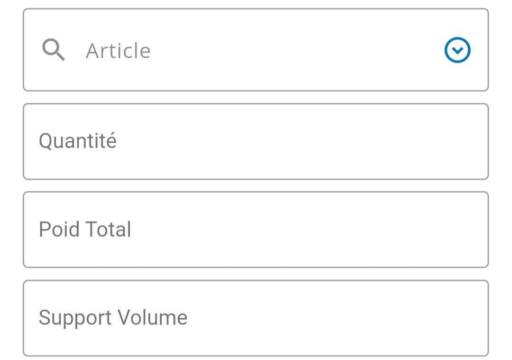

# Smart Search Dropdown

A customizable Flutter dropdown widget with search functionality.


## Features

- **Searchable Dropdown:** Easily search and select items from a list.
- **Customizable:** Adjust colors, labels, and loading indicators to fit your app's design.
- **Flexible Integration:** Seamlessly integrate the Smart Search Dropdown into your Flutter app.

## Installation

Add the following to your `pubspec.yaml`:

```yaml
dependencies:
  smart_search_dropdown: ^1.0.0
```

## Usage

Here's how to use the `SmartSearchDropdown` widget in your Flutter app:

### Basic Usage

```dart
import 'package:flutter/material.dart';
import 'package:smart_search_dropdown/smart_search_dropdown.dart';

void main() {
  runApp(MyApp());
}

class MyApp extends StatelessWidget {
  @override
  Widget build(BuildContext context) {
    return MaterialApp(
      home: Scaffold(
        appBar: AppBar(
          title: Text('Smart Search Dropdown Example'),
        ),
        body: Center(
          child: SmartSearchDropdown(
            controller: TextEditingController(),
            items: [
              SmartSearchDropdownItem(value: '1', description: 'Item 1'),
              SmartSearchDropdownItem(value: '2', description: 'Item 2'),
              SmartSearchDropdownItem(value: '3', description: 'Item 3'),
            ],
            selectedItem: '2',
            onItemSelected: (item) {
              print('Selected item: ${item.description}');
            },
          ),
        ),
      ),
    );
  }
}
```

## Screenshots

Dropdown Example 1


Dropdown Example 2

